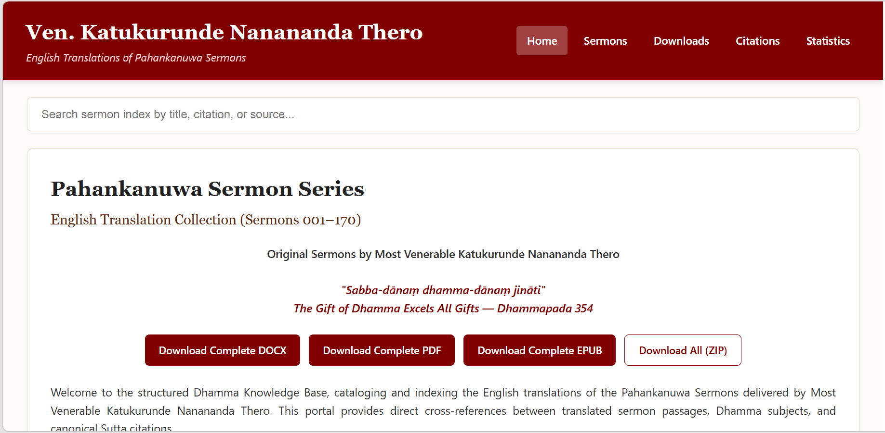

# Pahankanuwa English Translations

> 📚 170 Sermons • 166 Subjects • 2815 Citations • 14 Sutta Sources

## English Translations of the Pahankanuwa Sermons of Ven. Katukurunde Nanananda Thero

### 🌐 Online Knowledge Base

[Browse the Knowledge Base](https://chamaniw.github.io/Pahankanuwa-english-translations/)

### 📥 Download Complete Translation Collection

[Download All English Translations (ZIP)](https://github.com/chamaniw/Pahankanuwa-english-translations/raw/refs/heads/main/Pahankanuwa_English_Translations.zip)

### 📚 Archive Backup

[View Archive.org Backup](https://archive.org/details/pahankanuwa-english-translations-main)

---
## Related Resources

### Sinhala Pahankanuwa Collection

Original Sinhala editions and study resources:

[Dharmapress Sinhala Collection](https://dharmapress.github.io/)

---

## About This Project

This repository contains English translations of the Pahankanuwa sermons of Ven. Katukurunde Nanananda Thero.

The translations were created from digitised editions of the Pahankanuwa sermon series. Original sermon texts were OCR processed from publicly available PDF editions.

The English translations were produced through a collaborative workflow involving:

- OCR correction
- AI-assisted translation
- Human review and proofreading

The project is intended as a freely accessible Dhamma study resource.

---

## Online Knowledge Base Features

The online knowledge base includes:

- Searchable sermon index
- Citation index
- Direct links to translation documents
- Collection statistics

Visit:

https://chamaniw.github.io/Pahankanuwa-english-translations/

---

## Downloads

### 📖 Read Online

🌐 [Browse English Translation Knowledge Base](https://chamaniw.github.io/Pahankanuwa-english-translations/)

🇱🇰 [Browse Sinhala Pahankanuwa Collection](https://dharmapress.github.io/)

### 📥 Download Complete Collections

📄 docs/Pahankanuwa_Sermons_Complete.docx

📕 docs/Pahankanuwa_Sermons_Complete.pdf

📚 docs/Pahankanuwa_Sermons_Complete.epub

🗜️ [English Translation Collection (ZIP)](Pahankanuwa_English_Translations.zip)

### 📂 Browse Individual Sermons

📕 [Browse PDF Sermons (001–170)](pdf/)

📚 [Browse EPUB Sermons (001–170)](epub/)

📄 [Browse DOCX Sermons (001–170)](docs/docx/)

### 🗄️ Archive Backup

📚 [View Archive.org Backup](https://archive.org/details/pahankanuwa-english-translations-main)---

## Disclaimer

These translations are provided for educational and Dhamma-study purposes only.

They are not intended for commercial use.

All credit for the original sermons belongs to Ven. Katukurunde Nanananda Thero and the original publishers.

If you are a copyright holder and have concerns regarding distribution of these materials, please contact the repository maintainer.